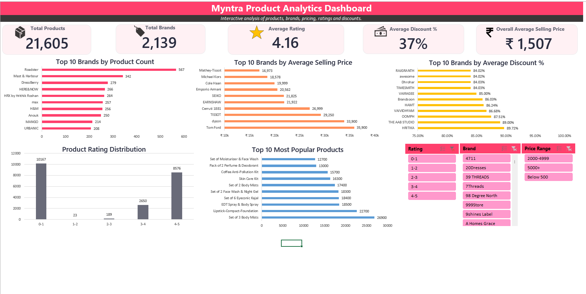

# Myntra E-Commerce Analytics Dashboard

An interactive Excel dashboard built to analyze Myntra's product catalog, pricing, discounts, customer ratings, and brand performance. This project demonstrates the complete analytics workflow; from data cleaning and exploratory analysis to KPI development and dashboard creation using Microsoft Excel.

---

## Dashboard Preview



---

## 📌 Project Overview

The goal of this project was to transform raw e-commerce data into an interactive dashboard that helps users understand product trends, pricing strategies, customer ratings, and brand performance.

The dashboard allows users to filter and explore data dynamically using slicers, making it easier to uncover meaningful business insights.

---

## Objectives

- Clean and validate raw product data
- Create meaningful business KPIs
- Analyze brand performance and pricing trends
- Identify the most popular products based on customer engagement
- Build an interactive Excel dashboard for decision-making

---

## 📂 Dataset Information

**Source:** Myntra Product Dataset

**Dataset Summary**

- Total Products: **21,605**
- Total Brands: **2,139**
- File Format: **CSV**

### Dataset Fields

- Product Name
- Brand Name
- Rating
- Rating Count
- Marked Price
- Discounted Price
- Sizes
- Product Link

---

## Data Cleaning

Before building the dashboard, the dataset was cleaned and validated by:

- Removing duplicate records
- Checking for missing values
- Validating ratings and prices
- Standardizing brand names
- Verifying pricing consistency
- Creating calculated columns:
  - Discount Amount
  - Discount Percentage
  - Price Range
  - Rating Category

---

## 📈 Dashboard KPIs

The dashboard highlights five key business metrics:

- 📦 Total Products
- 🏷️ Total Brands
- ⭐ Average Rating
- 💸 Average Discount Percentage
- 💰 Overall Average Selling Price

---

## 📊 Dashboard Features

The dashboard includes:

- Top 10 Brands by Product Count
- Top 10 Brands by Average Selling Price
- Top 10 Brands by Average Discount Percentage
- Product Rating Distribution
- Top 10 Most Popular Products

### Interactive Filters

- Brand
- Rating
- Price Range

---

## 🔍 Key Insights

- Roadster has the largest product catalog.
- Tom Ford records the highest average selling price.
- HRITIKA offers the highest average discount percentage.
- Most products are rated between **4–5 stars**, indicating generally positive customer feedback.

---

## 🛠️ Tools & Skills

**Tools**

- Microsoft Excel
- Pivot Tables
- Pivot Charts
- Slicers

**Skills Demonstrated**

- Data Cleaning
- Exploratory Data Analysis (EDA)
- KPI Development
- Dashboard Design
- Data Visualization
- Business Analysis

---

## 📁 Repository Structure

```
Myntra-ECommerce-Analytics-Dashboard
│
├── Dashboard
│   └── Myntra_ECommerce_Analytics_Dashboard.xlsx
│
├── Dataset
│   └── myntra_raw_dataset.csv
│
├── Images
│   └── dashboard_preview.png
│
└── README.md
```

---

## Getting Started

1. Clone or download this repository.
2. Open the Excel workbook from the **Dashboard** folder.
3. Navigate to the **Dashboard** worksheet.
4. Use the slicers to interact with the dashboard.

---

## 👨‍💻 Author

**Ronak Agarwall**

If you found this project helpful or have any suggestions, feel free to connect or share your feedback.

⭐ If you like this project, consider giving it a star!
